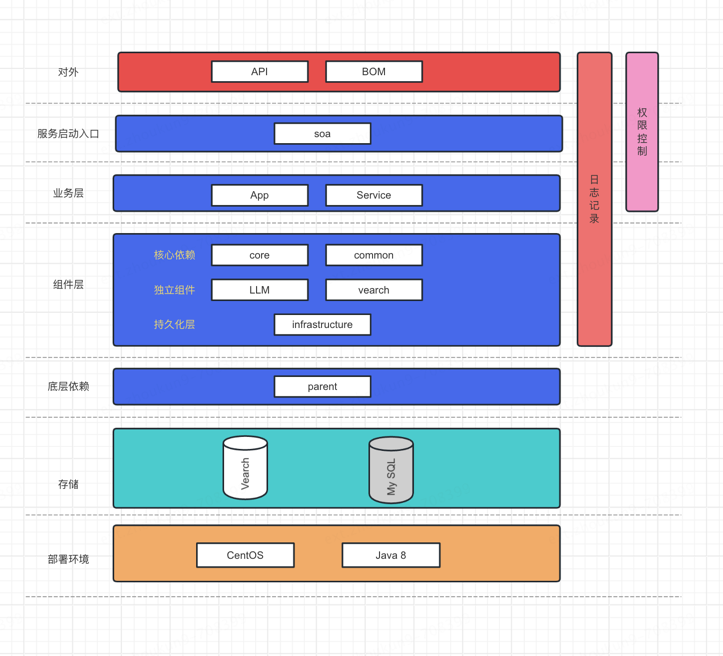

> 这是一个关于LLM应用的实验性项目。

* decoration-ai-api 模块是对外API层，用于提供RPC服务的依赖包。
* decoration-ai-soa 业务层部署模块，项目的启动入口。
* decoration-ai-infrastructure 持久化层。
* decoration-ai-bom 对外bom
* decoration-ai-parent 对内pom
* decoration-ai-service 服务实现层，用于实现业务逻辑以RPC接口实现
* decoration-ai-vearch jdVearch 服务层(后期会被替换为LangChain组件)
* decoration-ai-common 公共组件层，用于存放公共的常量、枚举等
* decoration-ai-core 核心组件层（待设计）
* decoration-ai-llm llm核心层，用于关于llm的配置和服务
* decoration-ai-app app层用于封装业务代码与业务特征

